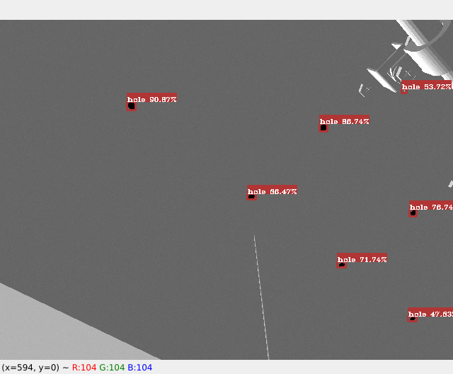

# More Than YOLO

TensorFlow & Keras & Python

YOLOv3, YOLOv3-tiny, YOLOv4, YOLOv4-tiny

[**Unofficial**] YOLOv4-tiny, YOLOX

---

## 0. Please Read Source Code for More Details

Official weight files can be downloaded from https://github.com/AlexeyAB/darknet/releases.

---

## 1. Samples

### 1.1 Data Annotations

The data can be annotated with [labelImg](https://pypi.org/project/labelImg/).

<video src="https://user-images.githubusercontent.com/83463058/154074675-7627a644-f630-4042-b16e-f47f5166ca14.mp4"></video>

### 1.2 Data File

A special data format is used:

```txt
path/to/image1 x1,y1,x2,y2,label x1,y1,x2,y2,label
path/to/image2 x1,y1,x2,y2,label
...
```

Firstly, the labelImg annotated data have to be converted using:

<video src="https://user-images.githubusercontent.com/83463058/154074671-5d5a5603-1b09-4f1c-b90f-27635c4a5e85.mp4"></video>

```shell
python3 tools/voc_to_yolox/voc_to_yolox_converter.py
```

### 1.3 K-Means

`kmeans.py` can be used to computed the anchor boxes

```shell
python3 kmeans.py --dataset_path=example/hole_detector/data/train.txt --image_size=416
```

Output:
```shell
Dataset has 52 annotations
K-Means Result:
5,4 6,6 7,7 7,5 8,7 9,9
```

### 1.4 Configure

```yaml
# yolox/example/hole_detector/cfgs/hole.yaml
yolo:
  type: "yolox" # must be 'yolov3', 'yolov3_tiny', 'yolov4', 'yolov4_tiny' ‘unofficial_yolov4_tiny’ or 'yolox'.
  iou_threshold: 0.5
  score_threshold: 0.45
  max_boxes: 100
  strides: "32,16"
  anchors: "5,4 5,5 6,6 7,5 7,7 9,8" # From kmeans.py
  mask: "3,4,5 0,1,2"
  name_path: "./example/hole_detector/data/hole.names"

train:
  label: "hole_detector"
  anno_path: "./example/hole_detector/data/train.txt"
  image_size: "224,256,288,320,352,384,416" # "416" for single mini batch size, "352,384,416,448,480" for Dynamic mini batch size.

  train_times: 20 # Repeat N times the dataset (using data augmentation)

  batch_size: 4
  init_weight_path: "./ckpts/yolov4-tiny.h5" # From scratch if empty ("")
  save_weight_path: "./ckpts"

  loss_type: "CIoU+FL" # Must be "L2", "DIoU", "GIoU", "CIoU" or something like "L2+FL" for focal loss

  mosaic: true
  label_smoothing: false
  normal_method: true

  ignore_threshold: 0.5

test:
  anno_path: "./example/hole_detector/data/valid.txt"
  image_size: "416"
  batch_size: 1
  init_weight_path: "./example/hole_detector/models/tiny_yolox.h5"
```

### 1.5 Inference

#### A Simple Script for Images

```shell
python3 simple_detector.py --image_folder=example/hole_detector/data/Images/ --model=example/hole_detector/models/tiny_yolox --class_names=example/hole_detector/data/hole.names
```

<video src="https://user-images.githubusercontent.com/83463058/154074661-95a50a32-f1c3-4f02-bf1e-80fce3858618.mp4
"></video>

#### A Script for Video, Device or Image

Only support mp4, avi, device id, rtsp, png, jpg (Based on OpenCV)

```shell
python3 detector.py --config=example/hole_detector/cfgs/hole.yaml --media=example/hole_detector/data/Images/frame0007.jpg
```



---

## 2. Train

```shell
python3 train.py --config=example/hole_detector/cfgs/hole.yaml
```

The trained models and weights will be located at `yolox/ckpts`.
- `mAP-0.XXXX` files represent the full model in Keras format. Those models can be used with `simple_detector.py`.
- `mAP-0.XXXX.h5` files contain only the weight.

---

## 3. Evaluation

```shell
python3 eval.py --config=example/hole_detector/cfgs/hole.yaml
```

**Note:** In the configuration file (`.yaml` file), the weights and the annotation wich are evaluated are located in `test`:

```yaml
test:
  anno_path: "./example/hole_detector/data/valid.txt"
  image_size: "416"
  batch_size: 1
  init_weight_path: "./ckpts/tmp/hole_detector/202202151131/mAP-0.5998.h5"
```

## 4. Experiment

### 4.1 Speed

**i7-9700F+16GB**

| Model       | 416x416 | 512x512 | 608x608 |
| ----------- | ------- | ------- | ------- |
| YOLOv3      | 219 ms  | 320 ms  | 429 ms  |
| YOLOv3-tiny | 49 ms   | 63 ms   | 78 ms   |
| YOLOv4      | 344 ms  | 490 ms  | 682 ms  |
| YOLOv4-tiny | 51 ms   | 66 ms   | 83 ms  |
| Unofficial-YOLOv4-tiny | 64 ms   | 86 ms   | 110 ms  |
| YOLOX | 67 ms | 83 ms | 104 ms |

**i7-9700F+16GB / RTX 2070S+8G**

| Model       | 416x416 | 512x512 | 608x608 |
| ----------- | ------- | ------- | ------- |
| YOLOv3      | 59 ms   | 66 ms   | 83 ms   |
| YOLOv3-tiny | 28 ms   | 30 ms   | 33 ms   |
| YOLOv4      | 73 ms   | 74 ms   | 91 ms   |
| YOLOv4-tiny | 30 ms   | 32 ms   | 35 ms  |
| Unofficial-YOLOv4-tiny | 30 ms   | 31 ms   | 34 ms   |
| YOLOX | 42 ms | 45 ms | 50 ms |

### 4.2 Logs

**Augmentations**

| Name                    | Abbr |
| ----------------------- | ---- |
| Standard Method         | SM   |
| Dynamic mini batch size | DM   |
| Label Smoothing         | LS   |
| Focal Loss              | FL   |
| Mosaic                  | M    |
| Warm-up LR              | W    |
| Cosine Annealing LR     | CA   |

Standard Method Package includes Flip left and right,  Crop and Zoom(jitter=0.3), Grayscale, Distort, Rotate(angle=7).

**YOLOv3-tiny**(Pretrained on COCO; Trained on VOC)

| SM   | DM   | LS   | FL   | M    | Loss | AP   | AP@50 | AP@75 |
| ---- | ---- | ---- | ---- | ---- | ---- | ---- | ----- | ----- |
| ✔    |      |      |      |      | L2   | 26.6 | 61.8 | 17.2  |
| ✔    | ✔    |      |      |      | L2   | 27.3 | 62.4 | 17.9  |
| ✔    | ✔    | ✔    |      |      | L2   | 26.7 | 61.7  | 17.1 |
| ✔    | ✔    |      |      |      | CIoU | 30.9 | 64.2  | 25.0 |
| ✔    | ✔    |      | ✔    |      | CIoU | 32.3 | 65.7 | 27.6  |
| ✔    | ✔    |      | ✔    | ✔    | CIoU |  |  |  |

**YOLOv3**(TODO; Pretrained on COCO; Trained on VOC; only 15 epochs)

| SM   | DM   | LS   | FL   | M    | Loss | AP   | AP@50 | AP@75 |
| ---- | ---- | ---- | ---- | ---- | ---- | ---- | ----- | ----- |
| ✔    | ✔    |      | ✔    |      | CIoU | 46.5 | 80.0  | 49.0  |
| ✔    | ✔    |      | ✔    | ✔    | CIoU |      |       |       |

**YOLOv4-tiny**(TODO; Pretrained on COCO;  Trained on VOC)

| SM   | DM   | LS   | FL   | M    | Loss | AP   | AP@50 | AP@75 |
| ---- | ---- | ---- | ---- | ---- | ---- | ---- | ----- | ----- |
| ✔    | ✔    |      | ✔    |      | CIoU | 35.1 | 70.2  | 30.0  |
| ✔    | ✔    |      | ✔    | ✔    | CIoU |      |       |       |

**YOLOv4**(TODO; Pretrained on COCO;  Trained on VOC)

| SM   | DM   | LS   | FL   | M    | Loss | AP   | AP@50 | AP@75 |
| ---- | ---- | ---- | ---- | ---- | ---- | ---- | ----- | ----- |
| ✔    | ✔    |      | ✔    |      | CIoU |      |       |       |
| ✔    | ✔    |      | ✔    | ✔    | CIoU |      |       |       |

**Unofficial-YOLOv4-tiny**(TODO; Pretrained on COCO, part of YOLOv3-tiny weights; Trained on VOC)

| SM   | DM   | LS   | FL   | M    | Loss | AP   | AP@50 | AP@75 |
| ---- | ---- | ---- | ---- | ---- | ---- | ---- | ----- | ----- |
| ✔    | ✔    |      | ✔    |      | CIoU | 35.0 | 65.7  | 33.8  |
| ✔    | ✔    |      | ✔    | ✔    | CIoU |      |       |       |

**YOLOX**(TODO; Pretrained on COCO, part of YOLOv4-tiny weights; Trained on VOC)

| SM   | DM   | LS   | FL   | M    | Loss | AP   | AP@50 | AP@75 |
| ---- | ---- | ---- | ---- | ---- | ---- | ---- | ----- | ----- |
| ✔    | ✔    |      | ✔    |      | CIoU | 40.6 | 72.2  | 40.3  |
| ✔    | ✔    |      | ✔    | ✔    | CIoU |      |       |       |
